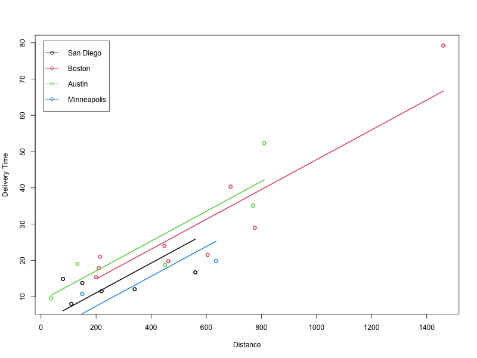
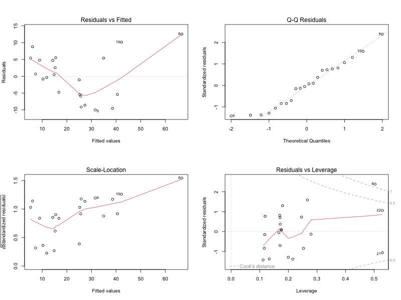

# Evaluating Factors Influencing Delivery Time

## Project Overview

This project analyzes the factors influencing delivery times based on a dataset containing information on delivery times, number of cases, distance traveled, and city of delivery. The objective is to build and evaluate a model predicting delivery time and assess the significance of the city variable, compare different models, and explore delivery time trends by distance across different cities. Additionally, residuals are analyzed to ensure model adequacy.

## R Studio and R Markdown Setup

### Prerequisites

1. **R**: Install R from [CRAN](https://cran.r-project.org/).
2. **RStudio**: Install RStudio from [RStudio's website](https://rstudio.com/products/rstudio/download/).
3. **Required R Packages**: Ensure the following packages are installed. You can install them using `install.packages()` in R:

    ```r
    install.packages(c("knitr", "ggplot2"))
    ```

### Project Setup

1. **Create a New R Markdown File**: Open RStudio, go to `File` -> `New File` -> `R Markdown`, and enter the title and author information.

2. **Include the Dataset**: Save the dataset file named `data1.csv` in the project's working directory.

3. **Knitr Options**: Set up `knitr` options to ensure code is included in the document:

    ```r
    knitr::opts_chunk$set(echo = TRUE)
    ```

### Running the Analysis

1. **Load the Data**: Read the dataset into R:

    ```r
    delivery = read.csv('data1.csv', header=TRUE)
    ```

2. **Model Building**: Fit the linear model relating delivery time to the number of cases, distance, and city indicators.

3. **Statistical Testing**: Use ANOVA to test the significance of the city variable in the model.

4. **Trend Analysis**: Analyze and plot the trend lines of delivery time against distance by city.

5. **Residual Analysis**: Evaluate model residuals to check for adequacy.

## Findings

### 1. Model that Relates Delivery Time to Cases, Distance, and City

The fitted model equation is:

\[ \hat{y} = 0.52 + 1.78x_1 + 0.01x_2 + 2.33i_1 + 3.80i_2 - 0.26i_3 \]

Where:
- \( x_1 \) = Number of cases
- \( x_2 \) = Distance
- \( i_1, i_2, i_3 \) = City indicators (San Diego, Boston, Austin)

### 2. City as a Significant Variable

ANOVA results showed that the city variable was not statistically significant. The observed F-statistic (1.848) was less than the critical F-value (3.230), leading us to conclude that city indicators do not significantly affect delivery time.

### 3. Trend Lines of Delivery Time vs. Distance by City

We analyzed how delivery time varies with distance across different cities. The plotted trend lines show the following ranking of delivery times:

- **Minneapolis** < **San Diego** < **Boston** < **Austin**



### 4. Residuals and Model Adequacy

Diagnostic plots of residuals suggest potential issues with model independence and a slight positive skew in the QQ plot.



These observations indicate areas where the model could be improved for better accuracy and performance.

## Conclusion

The analysis highlighted that city-specific factors were not significant in predicting delivery time based on our dataset. Delivery time trends varied across cities with distance, and residual analysis revealed potential model adequacy issues. Future work will involve addressing these issues to refine the model.

## Accessing the Files

- **Data File**: `data1.csv`
- **R Markdown File**: `your_project.Rmd` (Replace `your_project` with the name of your R Markdown file)
- **Plot of Delivery Time vs. Distance**: [plot.png](plot.png)
- **Diagnostic Residual Plots**: [diagnostic_plots.png](diagnostic_plots.png)

Feel free to explore and analyze further based on the provided findings and visualizations.