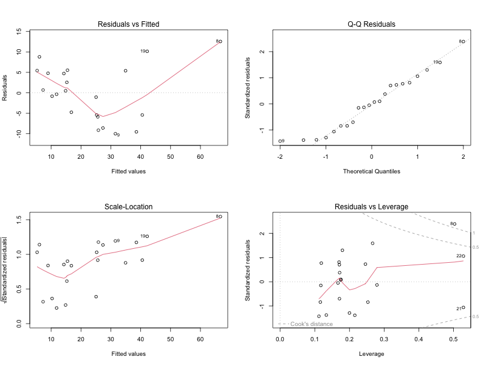

```{r setup, include=FALSE}
knitr::opts_chunk$set(echo = TRUE)
```

# Introduction

In this analysis, we investigate the factors influencing delivery times using a dataset containing information on delivery times, number of cases, distance traveled, and the city of delivery. Our primary goal is to build and evaluate a model that predicts delivery time based on these variables. We will assess the significance of the city as a variable, compare different models, and explore how delivery time varies with distance across different cities. Additionally, we will analyze the residuals of our model to check for adequacy and make necessary adjustments.

# 1.0 Model that Relates Delivery Time to Cases, Distance, and City
We start by building a linear model to understand how delivery time (y) is influenced by the number of cases (x1), distance (x2), and the city of delivery. The city is included as categorical indicators.

```{r}
# Read the dataset
delivery = read.csv('data1.csv', header=TRUE)

# Create indicator variables for the cities
i1 <- ifelse(delivery$city == 'San Diego', 1, 0)
i2 <- ifelse(delivery$city == 'Boston', 1, 0)
i3 <- ifelse(delivery$city == 'Austin', 1, 0)

# Fit the linear model
model <- lm(y ~ x1 + x2 + i1 + i2 + i3, data = delivery)
summary(model)

```
The fitted model equation is ŷ = 0.52 + 1.78x1 + 0.01x2 + 2.33i1 + 3.80i2 - 0.26i3. This equation shows how delivery time is influenced by the number of cases, distance, and city-specific factors.

# 2.0 Analysis of Delivery Site as an Important Variable
To determine if the city significantly affects delivery time, we compare the full model (which includes city indicators) with a reduced model (excluding city indicators) using ANOVA.

```{r}
# Fit the models for comparison
model.1 = lm(y ~ x1 + x2 + i1 + i2 + i3, data = delivery)
model.2 = lm(y ~ x1 + x2, data = delivery)

# Perform ANOVA
anova(model.2, model.1)
```

Calculate the critical F-value for hypothesis testing:

```{r}
# Critical F-value
alpha = 0.05
qf(1 - alpha, 3, 16)
```

Hypothesis Test:

  Null Hypothesis (H0): The coefficients are equal, i.e., β3=β4=β5=0
  Alternative Hypothesis (Ha): At least one of the coefficients is not zero (i.e β3,β4, and β5 are not all equal to 0)

Test Statistics:

  The observed F-statistic (Fobs) is calculated as follows:
  Fobs= ((224.42−166.67)/3) / (166.67/16) = 1.848

Rejection Region:

  Reject H0 if F > F(3,16) = 3.230

Conclusion:

  Since the observed F-statistic (Fobs = 1.848) is less than the critical F-value (3.239), we do not reject the null hypothesis. 
  Therefore, the city variable does not appear to be a significant factor in estimating delivery time.


# 3.0 Trend Lines of delviery time to distance by city

We analyze how delivery time varies with distance, stratified by city, and plot trend lines for each city.

```{r, echo = FALSE, message=FALSE, warning=FALSE}
# Fit the model with distance and city indicators
model <- lm(y ~ x2 + i1 + i2 + i3, data = delivery)

# Assign numeric values to cities for plotting
trt <- delivery$city
trt[delivery$city == 'San Diego'] <- 1
trt[delivery$city == 'Boston'] <- 2
trt[delivery$city == 'Austin'] <- 3
trt[delivery$city == 'Minneapolis'] <- 4

# Save the plot to a PNG file
png("plot.png", width = 800, height = 600)

# Plot delivery time against distance with trend lines for each city
plot(x = delivery$x2, y = delivery$y, col = as.numeric(trt), lwd = 2, 
     xlab = 'Distance', ylab = 'Delivery Time',
     panel.last = c(lines(sort(delivery$x2[trt == 1]),
                          fitted(model)[trt == 1][order(delivery$x2[trt == 1])],
                          col = 1, lwd = 2),
                    lines(sort(delivery$x2[trt == 2]),
                          fitted(model)[trt == 2][order(delivery$x2[trt == 2])],
                          col = 2, lwd = 2),
                    lines(sort(delivery$x2[trt == 3]),
                          fitted(model)[trt == 3][order(delivery$x2[trt == 3])],
                          col = 3, lwd = 2),
                    lines(sort(delivery$x2[trt == 4]),
                          fitted(model)[trt == 4][order(delivery$x2[trt == 4])],
                          col = 4, lwd = 2)))

# Add legend
legend("topleft", col = 1:4, pch = 1, lty = 1,
       inset = .02, x.intersp = 1.5, y.intersp = 1.8,
       legend = c("San Diego", "Boston", "Austin", "Minneapolis"))

```

```{r include-plot, echo = FALSE, message=FALSE, warning=FALSE}
# Include the saved plot
knitr::include_graphics("plot.png")
```

Based on the plot, we rank the delivery times of the four cities as follows: Minneapolis < San Diego < Boston < Austin.

# 4.0 Analyzing the residuals and model adequacy
To evaluate the model's adequacy, we examine the residual plots and the QQ plot.

```{r save-diagnostic-plots, echo=FALSE}
# Fit the model with distance and city indicators
model <- lm(y ~ x2 + i1 + i2 + i3, data = delivery)

# Save the diagnostic plots to a PNG file
png("diagnostic_plots.png", width = 800, height = 600)

# Set up the plotting area for multiple plots
par(mfrow = c(2, 2))

# Plot the diagnostic plots
plot(model)
```

```{r include-plot2, echo=FALSE}
# Include the saved plot

```

The residual plots suggest potential issues with independence, and the QQ plot indicates a slight positive skew. 
These issues may require further investigation to improve model performance.

# Conclusion
In this analysis, we developed a model to predict delivery time based on the number of cases, distance, and city of delivery. We found that the city variable was not statistically significant in our model. The analysis of delivery time trends by distance indicated varying patterns across cities. Finally, the residual analysis highlighted potential areas for improvement in model adequacy. Future work may involve addressing these residual issues and refining the model for better predictive accuracy.
